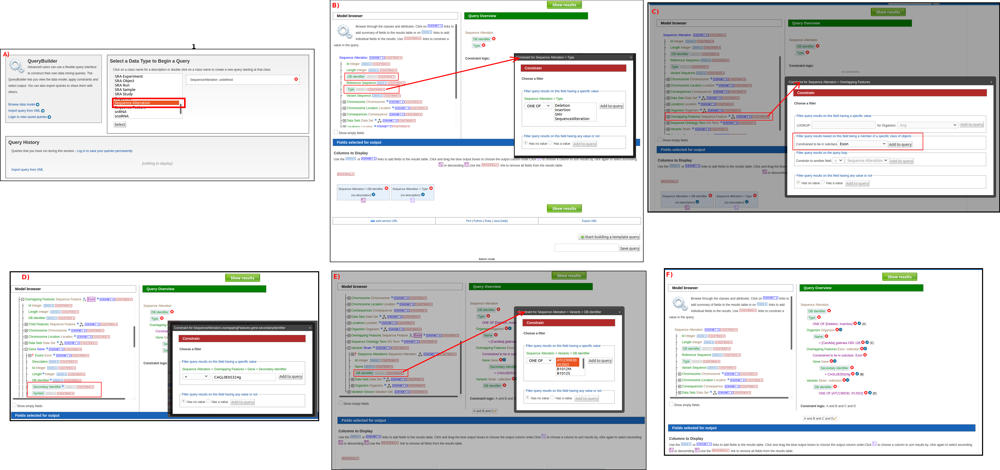

============
Query Buidler
============

While the templates provided are suitable for many different types of searches, new queries may be built from scratch using the **QueryBuilder**. The possibilities of queries using the QueryBuilder are endless. The output may be formatted exactly as desired, and the query constraints may be chosen to perform complex search operations. Query builder provides an easy way to create new search queries. Query builder has a fast learning curve and provides flexible tools to design complex queries that could target all stored information in CandidaMine.
For more detail documantion about Query Buidler; readers are encouraged to see https://flymine.readthedocs.io/en/latest/query-builder/index.html

Model browser
-------------

After choosing a data type, the **Model browser**  appears displaying the attributes for the selected feature class.

Examples
--------

The following examples will provided details steps on how to use Query Buidler to build your own custom queries.

Example : Querying for INDELS in coding regions
^^^^^^^^^^^^^^^^^^^^^^^^^^^^^^^^^^^^^^^^^^^^

Building a new query  starts  by choosing a data type of interest e.g gene or transcript based on the required result. After choosing a data type, the Model browser appears displaying the attributes for the selected feature class. Figure shows an example of building a new query to select all insertions and deletions with coding regions of a specific gene of interest filtered by some strains similar to template query shown in :numref:`cq_indels`. In this case Sequence Alteration data type (based on SO terms) was selected :numref:`cq_indels` A. Then desired attributes that would be retrieved in the result table are selected. To restrict the retrieved sequence alterations to be of Insertion or Deletion, a constraint is added to the query by selecting constain button then configure the filter as shown in :numref:`cq_indels` B. Sequence Alteration data type is a sequences feature that overlap with other genomic sequence features, we can selected to retrieve all overlapping feature with the result Sequences alteration, however to select only those within coding region we constrain overlapping feature to be of only Exon data type as shown in :numref:`cq_indels` C. Once Overlapping features are constrained as Exons, more attributes are shown in the model browser under it e.g parent Gene. Accordingly we can constrain the parent gene of the exons as shown in :numref:`cq_indels` D and constrain the strains as shown in :numref:`cq_indels` E.        

.. _cq_indels:

  A step by step example on how to build a custom query to retrieve all insertion and deletions within the coding region of a target gene fitler by some strains. A) Select Object of interest in this case is Sequences altarion to begin designing the query. B) add basic attribute to the query result and constraint type attribute to be Deletion and Insertion. C) Constrain overlapping features to be only of type Exons. D) Add basic attribute of the gene from the Exon object and constain Secondary Identifier to specific gene of interest. E) Constrain Variant strain identifier. F) Final layout of the template after specifying all attributes to show in the result and the contains to control the final output.
  
  ..

Example 2: Querying for protein coding genes
^^^^^^^^^^^^^^^^^^^^^^^^^^^^^^^^^^^^^^^^^^^^

Example 3: Querying for protein coding genes
^^^^^^^^^^^^^^^^^^^^^^^^^^^^^^^^^^^^^^^^^^^^

Example 4: Querying for protein coding genes
^^^^^^^^^^^^^^^^^^^^^^^^^^^^^^^^^^^^^^^^^^^^

Example 5: Querying for protein coding genes
^^^^^^^^^^^^^^^^^^^^^^^^^^^^^^^^^^^^^^^^^^^^

Example 6: Querying for protein coding genes
^^^^^^^^^^^^^^^^^^^^^^^^^^^^^^^^^^^^^^^^^^^^

