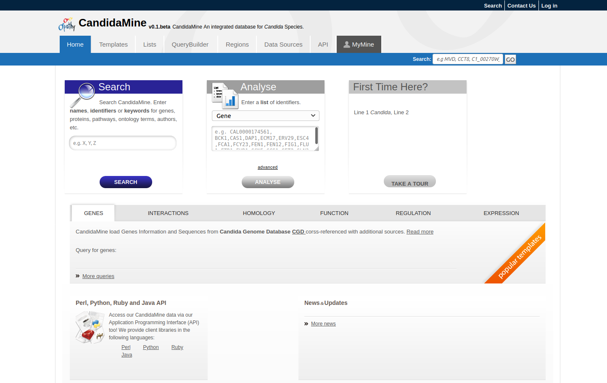

============
Report Page
============

Every object (e.g., Gene, Protein, Exon) in *CandidaMine* has a detialed report page. The layout of the report page depends on the data available for the object. Report pages may be accessed by clicking on an object name in the results table after running a query.

Example by keyword search -> search for ASH1. Clicking on an item in the result table will bring up its report page. For example clickng on ASH1 in Candida albicans with show its report page.

.. _report_page:

   **ASH1** Report page.

The report page :numref:`report_page` provides a complete description for this gene. The header displays the database identifier, followed by the information from the summary window for the gene (organism, symbol, source, etc.) **Biotype** indicates the type of gene; in this case the type is protein coding.

The contents of the report page are divided into categories based on the type of information provided.

Summary
~~~~~~~

A **Summary** section near the top of the report provides information on the gene such as its length, chromosome location, and strand information as shown in :numref:`report_page_summary`.

.. _report_page_summary:
.. figure:: images/report_page_summary.png
   :width: 696
   :alt: Summary section of report page
   :figclass: align-center
  
   Summary section of report page.
   

Genomics
~~~~~~~

Proteins
~~~~~~~
The **Proteins** section provides information about the protein product of gene. The comments section gives a brief description about the protein along with the UniProt accession.

Homology
~~~~~~~
The **Homology** section includes information on homologues for the gene.

Expression
~~~~~~~

Interactions
~~~~~~~

Other
~~~~~~~
This last section provides miscellaneous information that doesn't fit into any of the above categories, e.g., data sets including a gene, protein domain regions for a protein, etc.

